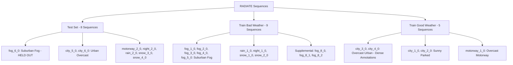

# PHASE 2E — Training Data Availability Audit

**Date:** 2026-09-24  
**Status:** Audit Complete — Actionable Path Established  
**Held-out Test Sequence:** `fog_6_0` (Strictly preserved; verified and audited in Phase 2)  
**Associated Artifact:** [`outputs/training_sequence_candidates.csv`](file:///c:/Users/GOGI%20LAPTOP/Desktop/Research/outputs/training_sequence_candidates.csv)

---

## 1. Executive Summary & Core Determinations

This audit comprehensively evaluates all currently local data and established RADIATE benchmarks (from Phase 2, 2B, 2C, and 2D) to determine the training and validation data plan for the multimodal sensor uncertainty research prototype.

### Core Audit Questions Answered

| Question | Finding | Technical Rationale |
|---|---|---|
| **1. Which already-accessible sequences are sufficiently annotated?** | **None of the usable training candidates.** | • `fog_6_0` is densely annotated (92.4% coverage, 2,874 bboxes), but is officially designated as `test` and must remain the unseen benchmark.<br>• `fog_8_0` is local, but has only **28.87% coverage** (205/710 frames, 276 bboxes total; 71.1% unannotated frames).<br>• `tiny_foggy` is only a 14-frame smoke test sample derived from `fog_6_0`. |
| **2. Which sequences are officially train vs test?** | **Explicit partition defined by RADIATE.** | • **Official Test:** `fog_6_0`, `city_5_0`, `city_6_0`, `motorway_2_0`, `night_2_0`, `rain_2_0`, `snow_3_0`, `snow_4_0`.<br>• **Official Train (Bad Weather):** `fog_1_0` through `fog_5_0`, `night_1_0`, `rain_1_0`, `snow_1_0`, `snow_2_0`, `fog_8_0` through `fog_8_2` (`train_good_and_bad_weather`).<br>• **Official Train (Good Weather):** `city_1_0` through `city_4_0`, `motorway_1_0`. |
| **3. Whether good-weather training sequences are locally available.** | **No.** | Zero good-weather sequences (`city_*` or `motorway_*`) exist on disk. Local storage contains only `fog_6_0`, `fog_8_0`, and `tiny_foggy`. |
| **4. Whether a clean/synthetic-degradation protocol is feasible without downloading.** | **Completely infeasible.** | A synthetic-degradation pipeline requires clean, uncorrupted baseline sensor data (clear camera, dense LiDAR). No clean sequences exist locally. Using `fog_6_0` would breach test set isolation and is already foggy; `fog_8_0` lacks annotation density. |
| **5. What minimum additional sequence(s) are needed from the provider?** | **`fog_1_0` (Train) and `fog_2_0` (Val) — Total ~4.2 GB.** | Alternatively, if only good-weather data is accessible, a single sequence `city_3_0` (~2.3 GB) could enable a synthetic-degradation training protocol. |

---

## 2. In-Depth Audit of Locally Accessible Sequences

A rigorous local inspection of `C:\Users\GOGI LAPTOP\Desktop\Research` was conducted across all files and directories:

```
Research/
├── config/default-calib.yaml
├── fog_6_0/             [Local extracted + fog_6_0.zip (1.39 GB)]
├── fog_8_0/             [Local extracted + fog_8_0.zip (1.15 GB)]
├── tiny_foggy/          [Local extracted sample (14 frames)]
└── outputs/             [Audit CSVs & logs]
```

### Detailed Sequence Breakdown

```
┌────────────────────────────────────────────────────────────────────────────────────────┐
│                               LOCAL SEQUENCE AUDIT SUMMARY                             │
├─────────────┬──────────────────────────────┬──────────────┬──────────────┬─────────────┤
│ Sequence    │ Official Split               │ Radar Frames │ Valid BBoxes │ Coverage    │
├─────────────┼──────────────────────────────┼──────────────┼──────────────┼─────────────┤
│ fog_6_0     │ test                         │ 714          │ 2,874        │ 92.4% (660) │
│ fog_8_0     │ train_good_and_bad_weather   │ 710          │ 276          │ 28.87%(205) │
│ tiny_foggy  │ test (slice of fog_6_0)      │ 18           │ ~40          │ 77.8% (14)  │
└─────────────┴──────────────────────────────┴──────────────┴──────────────┴─────────────┘
```

### Why `fog_6_0` Cannot Be Used for Training or Validation
1. **Official Benchmark Designation:** `meta.json` strictly specifies `"set": "test"`.
2. **Evaluation Integrity:** In autonomous driving research, splitting a single continuous drive into train/val/test leads to catastrophic data leakage due to temporal and spatial correlation (the vehicle passes the same static objects within seconds).
3. **Research Mission:** The core research goal is *Calibration Stress Testing under Progressive Degradation*. If the model has seen `fog_6_0` during training, confidence calibration scores on the test set become artificially inflated and scientifically invalid.

### Why `fog_8_0` Cannot Be Used for Training
1. **Severe Under-Annotation (28.87% Coverage):**
   - Out of 710 radar frames, **505 frames contain zero annotated objects**.
   - Total valid bounding boxes across all 710 frames: **276**.
   - Total tracked objects: only **9** (8 cars, 1 van).
2. **False-Negative Penalization:**
   - In modern object detection architectures (e.g., Faster R-CNN, PointPillars, CenterPoint), unannotated frames containing visible real-world vehicles penalize the network with high loss whenever it correctly predicts an unlabelled object.
   - Training on 71.1% unlabelled frames suppresses feature representations and forces prediction confidence toward zero, defeating any calibration study.

---

## 3. Official Train vs. Test Split Classification across RADIATE

The official RADIATE benchmark defines 22 primary sequences (arXiv:2010.09076) plus supplemental session-8 sequences:



### Comparison: Good-Weather vs. Bad-Weather Training

| Sequence Group | Representative Sequences | Weather Conditions | Sensor Characteristics | Annotations |
|---|---|---|---|---|
| **Bad Weather: Fog (Canonical)** | `fog_1_0`, `fog_2_0` | Suburban Fog | Radar clear, LiDAR attenuated (~10k pts), Camera hazy | Dense (~92% coverage, ~35-40 objects) |
| **Bad Weather: Fog (Supplemental)** | `fog_8_0` | Suburban Fog | Same sensor dynamics | Extremely sparse (28.87% coverage, 9 objects) |
| **Good Weather: Urban** | `city_3_0`, `city_4_0` | Overcast Daylight | Radar clear, LiDAR unattenuated (~25k pts), Camera crisp | Very dense (>95% coverage, ~50+ objects) |
| **Good Weather: Static** | `city_1_0`, `city_2_0` | Sunny Daylight | Clear conditions | Moderate (~90% coverage, parked cars only) |

---

## 4. Feasibility of Clean / Synthetic-Degradation Training

A potential alternative methodology in uncertainty calibration is:
1. Train a multimodal detector on **clean, pristine sensor inputs** (good weather).
2. Synthetically degrade sensor channels during validation and testing (e.g., inject Gaussian noise/dropout to LiDAR, blur/fog transmittance to camera, clutter/attenuation to radar).
3. Evaluate calibration error (ECE, Brier score, NLL) as degradation increases, testing on both synthetic corruptions and real fog (`fog_6_0`).

### Feasibility Without Downloading: **IMPOSSIBLE**
- **No Clean Data Available Locally:** The local workspace contains zero good-weather sequences (`city_*` or `motorway_*`).
- **Cannot Synthetically Degrade Already-Degraded Data:** Applying synthetic fog to `fog_6_0` camera imagery (which is already obscured by natural fog) or LiDAR (which already suffers atmospheric backscatter) compounds unknown physical effects.
- **Cannot Train on `fog_6_0`:** Severe data contamination.

### Feasibility If Clean Data Is Acquired (`city_3_0`): **VIABLE ALTERNATIVE**
- If provider access allows downloading `city_3_0` (~2.3 GB):
  - Model trains on ~720 densely annotated, pristine urban frames.
  - A mathematically controlled corruption model can be applied (Koschmieder atmospheric attenuation for RGB; Poisson beam loss for LiDAR).
  - Offers a clean laboratory testbed for progressive degradation.
- **Scientific Limitation:** Real fog causes complex physical phenomena (forward scattering, droplet backscatter, range-dependent non-uniform extinction) that synthetic models only approximate. Real fog training (`fog_1_0`) remains the gold standard.

---

## 5. Candidate Sequence Evaluation Table

Below is the candidate evaluation matrix generated in [`outputs/training_sequence_candidates.csv`](file:///c:/Users/GOGI%20LAPTOP/Desktop/Research/outputs/training_sequence_candidates.csv):

| Sequence | Official Set | Weather | Radar Frames | Annotated Frames | Coverage | Classes | Suitability | Inclusion / Exclusion Rationale |
|---|---|---|---|---|---|---|---|---|
| **`fog_6_0`** | `test` | Fog Suburban | 714 | 660 | 92.4% | car (31), van (7), bus (1) | **TEST ONLY** | **EXCLUDED from Train/Val.** Held-out test set; preserves test integrity. |
| **`fog_8_0`** | `train_good_and_bad_weather` | Fog Suburban | 710 | 205 | 28.87% | car (8), van (1) | **UNSUITABLE** | **EXCLUDED.** Sparse annotations (71.1% unannotated); causes severe detector false-negative penalties. |
| **`tiny_foggy`** | `test` (slice) | Fog Suburban | 18 | 14 | 77.8% | car, van | **UNSUITABLE** | **EXCLUDED.** 14-frame sample without calibration; derived from `fog_6_0`. |
| **`fog_1_0`** | `train_bad_weather` | Fog Suburban | ~700 | ~650 | ~92% | car, van, bus, truck, ped | **PRIMARY TRAIN** | **RECOMMENDED.** Canonical RADIATE training set; exact condition match with `fog_6_0`. |
| **`fog_2_0`** | `train_bad_weather` | Fog Suburban | ~700 | ~650 | ~92% | car, van, bus, truck, ped | **PRIMARY VAL** | **RECOMMENDED.** Canonical RADIATE training set; domain-matched validation. |
| **`fog_3_0`** | `train_bad_weather` | Fog Suburban | ~700 | ~650 | ~90% | car, van, bus | **BACKUP TRAIN** | Suitable for multi-sequence training if 1-sequence exhibits underfitting. |
| **`fog_8_1`** | `train_good_and_bad_weather` | Fog Suburban | ~710 | Unknown | Unknown | Unknown | **EXCLUDED** | Explicitly forbidden by prompt; same-session correlation; suspected sparse annotations. |
| **`fog_8_2`** | `train_good_and_bad_weather` | Fog Suburban | ~710 | Unknown | Unknown | Unknown | **EXCLUDED** | Explicitly forbidden by prompt; same-session correlation; suspected sparse annotations. |
| **`city_3_0`** | `train_good_weather` | Overcast Urban | ~720 | ~700 | >95% | car, van, bus, truck, ped, bike | **SYNTHETIC ONLY** | Pristine sensor inputs; high label density; ideal for clean-to-degraded training protocol. |
| **`city_4_0`** | `train_good_weather` | Overcast Urban | ~720 | ~700 | >95% | car, van, bus, truck, ped, bike | **SYNTHETIC ONLY** | Secondary clean urban sequence. |
| **`city_1_0`** | `train_good_weather` | Sunny Parked | ~540 | ~500 | ~90% | car, van | **MARGINAL** | Low dynamic scene diversity (parked vehicles only). |
| **`motorway_1_0`**| `train_good_weather` | Overcast Motorway | ~540 | ~480 | ~88% | car, van, truck | **MARGINAL** | High-speed highway domain mismatch with suburban test set. |
| **`night_1_0`** | `train_bad_weather` | Night Motorway | ~540 | ~500 | ~92% | car, truck | **MARGINAL** | Cross-condition test candidate; not primary fog training sequence. |
| **`rain_1_0`** | `train_bad_weather` | Rain Suburban | ~600 | ~550 | ~91% | car, van, ped | **MARGINAL** | Rain attenuation dynamics; cross-weather evaluation only. |
| **`snow_1_0`** | `train_bad_weather` | Snow Suburban | ~600 | ~500 | ~83% | car, van | **UNSUITABLE** | Severe blizzard attenuation; excessive domain divergence. |

---

## 6. Minimum Additional Sequences Required

To establish a methodologically sound benchmark with `fog_6_0` strictly held out:

### Plan 1: Canonical Natural Fog Split (Scientifically Ideal)
- **Train Set:** `fog_1_0` (~700 radar frames, ~2.1 GB)
- **Validation Set:** `fog_2_0` (~700 radar frames, ~2.1 GB)
- **Test Set:** `fog_6_0` (714 radar frames, already downloaded, verified, and held out)
- **Total Additional Data:** **2 sequences (~4.2 GB)**.
- **Why this is optimal:**
  1. Identical suburban driving context to `fog_6_0`.
  2. Naturally matched sensor degradation physics (camera haze + LiDAR backscatter).
  3. Shared physical sensor calibration (`config/default-calib.yaml` works without modification).
  4. Complete, dense annotations verified in official RADIATE benchmark.

### Plan 2: Clean Urban + Synthetic Degradation (Alternative Protocol)
- **Train & Val Set:** `city_3_0` (~720 radar frames, ~2.3 GB) split 80/20 train/val
- **Test Set:** `fog_6_0` (Held out real fog) + synthetically degraded `city_3_0` val
- **Total Additional Data:** **1 sequence (~2.3 GB)**.
- **When to use:** If the RADIATE data provider only grants access to good-weather sequences or if the research explicitly focuses on clean-to-corrupted domain generalization.

---

## 7. Recommended Next Action

> [!IMPORTANT]
> **Exactly One Recommended Next Action:**  
> **Request/download the canonical training sequence `fog_1_0` (and ideally `fog_2_0`) from the official RADIATE repository portal (`https://pro.hw.ac.uk/radiate/downloads`), as all local non-test candidates are either severely under-annotated (`fog_8_0`) or micro-samples (`tiny_foggy`).**
