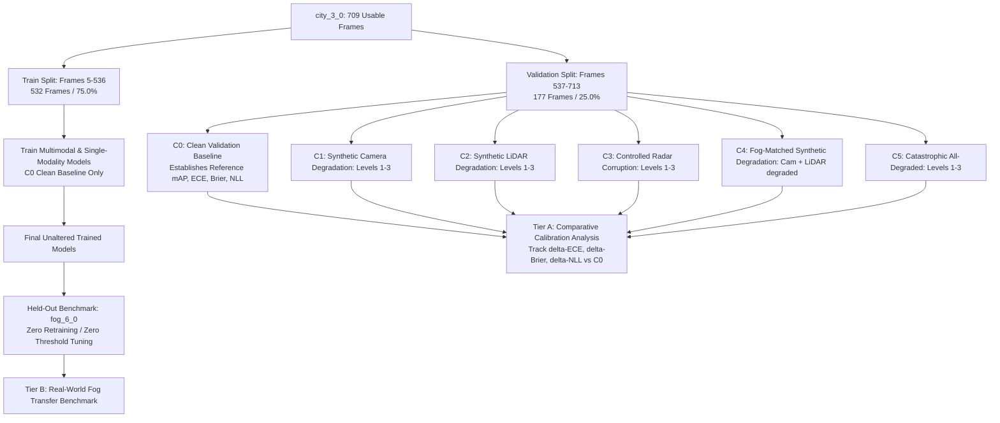

# PHASE 3A — Clean-to-Degraded Experimental Protocol (Methodology Patched)

**Date:** 2026-09-24  
**Revision:** v1.1 (Methodology Clarifications Patched)  
**Configuration File:** [`configs/experiment_protocol.yaml`](file:///c:/Users/GOGI%20LAPTOP/Desktop/Research/configs/experiment_protocol.yaml)  
**Train / Validation Source:** `city_3_0` (709 usable frames, `train_good_weather`)  
**Held-Out Test Benchmark:** `fog_6_0` (714 frames, `test`, completely untouched)

---

## 1. Executive Summary & Research Question

This protocol establishes the rigorous experimental setup for the research paper:

> **"Calibration Stress Testing of Multimodal Sensor Fusion under Progressive Sensor Degradation"**

### Central Scientific Hypothesis
In autonomous driving perception, multimodal sensor fusion improves nominal detection accuracy under clean conditions. However, when individual sensor modalities undergo progressive environmental or hardware degradation:
1. **The Overconfidence Pathology Hypothesis:** Multimodal neural networks fail to propagate sensor uncertainty to output classification confidences. Even as input signals deteriorate and true prediction accuracy drops, the model maintains inappropriately high confidence, leading to severe miscalibration (surging Expected Calibration Error and Overconfidence Error).
2. **The Calibrated Degradation Hypothesis:** An appropriately calibrated fusion model smoothly attenuates its output confidence in proportion to the severity of sensor corruption, reflecting heightened predictive entropy and avoiding false-certainty failure modes.

To test this hypothesis, we establish a **two-tier experimental paradigm**:
- **Tier A (Controlled Laboratory Experiment):** Train on clean multimodal data (`city_3_0` Train Split) and apply mathematically controlled, physically grounded synthetic corruptions to the validation split (`city_3_0` Val Split).
- **Tier B (Real-World Generalization Benchmark):** Evaluate the exact same models zero-shot on natural, real-world suburban fog (`fog_6_0`) without any retraining, threshold tuning, or hyperparameter selection on the test set.



---

## 2. Temporal Train/Validation Split for `city_3_0` (Task 1)

### Split Definition
- **Total Usable Frames:** 709 frames (Radar Frame 000005 to Frame 000713).
- **Excluded Frames (1–4):** Excluded due to initial camera startup delay ($\Delta t > 150\text{ ms}$).
- **Train Split (75.04%):** **Radar Frames 000005 to 000536** (532 frames)
  - Time window: $t = 1563273881.815\text{ s}$ to $t = 1563274014.513\text{ s}$ ($\Delta t = 132.70\text{ s}$)
- **Validation Split (24.96%):** **Radar Frames 000537 to 000713** (177 frames)
  - Time window: $t = 1563274014.763\text{ s}$ to $t = 1563274058.853\text{ s}$ ($\Delta t = 44.09\text{ s}$)

### Scientific Justification: Why Random Splitting Is Prohibited
In autonomous driving sensor datasets, consecutive frames are acquired at high frequency (4 Hz for Navtech radar, 10 Hz for LiDAR, 15 Hz for camera):
1. **Spatial Autocorrelation:** At 4 Hz, consecutive radar sweeps are separated by only 250 milliseconds. The ego vehicle travels less than 2–3 meters between adjacent frames, observing virtually identical static parked vehicles, buildings, and road infrastructure.
2. **Data Leakage & Deceptive Calibration:** If frames are randomly sampled (e.g., standard scikit-learn `train_test_split`), the validation set will contain frame $t+1$ while the training set contains frame $t$. The model merely retrieves memorized visual/radar features rather than learning generalizable representations. This creates:
   - Artificially inflated detection metrics ($mAP$).
   - Fictitiously low Expected Calibration Error ($ECE$).
   - A complete failure to evaluate true out-of-distribution uncertainty.
3. **Chronological Validity:** Partitioning the 3-minute continuous drive strictly into an earlier 75% segment and a later 25% segment ensures that the validation set presents unseen road segments, novel vehicle arrangements, and new intersection dynamics.

---

## 3. Baseline Multimodal Task Formulation & Dataset Taxonomy (Tasks 2, 7 & 8)

### Target Class Taxonomy for Primary Vehicle Experiment
For rigorous cross-dataset alignment with the held-out `fog_6_0` benchmark, the target classes are explicitly defined as:
1. `car` (Class 0)
2. `van` (Class 1)
3. `bus` (Class 2)

**Handling of Non-Vehicle Classes:**
- `city_3_0` contains labels for `pedestrian`, `group_of_pedestrians`, `truck`, `motorbike`, and `bicycle`.
- These classes are explicitly **ignored / treated as background** for the primary vehicle-only cross-evaluation experiment.
- **Data Integrity:** All original labels in the raw dataset (`annotations/annotations.json`) remain completely untouched and preserved. The class filter is applied dynamically in the PyTorch dataset loader.

### Coordinate System & Target Representation
- **Unified Coordinate Frame:** **Radar Bird's-Eye View (BEV) Cartesian frame**.
  - Origin: Navtech radar sensor position.
  - Forward axis: $+Y \in [0, 100]\text{ meters}$.
  - Lateral axis: $+X \in [-50, +50]\text{ meters}$ (right $+$, left $-$).
  - Spatial resolution: $0.17361\text{ m/pixel}$ ($1152 \times 1152$ full radar grid, crop/downsample to $512 \times 512$ or $576 \times 576$ for model input).
- **Target Format:** 2D BEV bounding boxes $[c_x, c_y, w, h]$ in radar metric space.

### Manageable Architecture Scope (Task 8)
The primary scientific contribution of this study is the **degradation and uncertainty-calibration methodology**, not the introduction of an overly complex novel architecture. To ensure experimental transparency, reproducibility, and computational manageability:
- **Radar Branch:** 1-channel 2D CNN backbone (ResNet-18) processing normalized Navtech Cartesian image.
- **LiDAR Branch:** 2-channel 2D BEV grid (normalized maximum height $Z$ + point count density) processed by ResNet-18 backbone.
- **Camera Branch:** RGB front image processed by ResNet-18, projected into BEV feature space via orthographic camera calibration geometry.
- **Fusion Neck:** Channel concatenation of aligned BEV feature maps followed by $1\times 1$ conv fusion and residual refinement.
- **Detection Head:** Standard single-stage anchor-free BEV detection head (CenterNet / FCOS style) predicting:
  - Heatmap center probability $\hat{p}(c \mid x) \in [0, 1]$ per class.
  - Bounding box dimension offsets $[\Delta x, \Delta y, w, h]$.

---

## 4. Physically-Grounded Synthetic Sensor Degradation Models (Tasks 3, 4 & 5)

```
┌────────────────────────────────────────────────────────────────────────────────────────┐
│                        PHYSICAL SENSOR DEGRADATION TAXONOMY                            │
├──────────┬─────────────────────────────┬───────────────────────────────────────────────┤
│ Modality │ Physical Phenomenon         │ Mathematical Formulation                      │
├──────────┼─────────────────────────────┼───────────────────────────────────────────────┤
│ Camera   │ Depth-Dependent Koschmieder │ I(x) = J(x)*exp(-beta*d(x)) + A*(1-exp(-...)) │
│ LiDAR    │ Beer-Lambert Laser Extinct. │ P_drop(r) = 1 - exp(-alpha_ext * r)           │
│ Radar    │ Controlled Radar Corruption │ S_deg = S * 10^(-loss/20) * Rayleigh(sigma)   │
└──────────┴─────────────────────────────┴───────────────────────────────────────────────┘
```

### 1. Camera: Depth-Dependent Koschmieder Fog Attenuation (Task 4)
- **Model:** Koschmieder's Law for daylight atmospheric scattering:
  $$I(x) = J(x) \cdot t(x) + A \cdot (1 - t(x))$$
  where $J(x)$ is clean RGB radiance, $A = [0.82, 0.82, 0.84]$ is the atmospheric airlight vector, $d(x)$ is scene depth, and $t(x) = \exp(-\beta \cdot d(x))$ is atmospheric transmittance.
- **Depth Completion Strategy:**
  - Uniform fog overlay is **explicitly forbidden** as the primary degradation method.
  - Scene depth $d(x)$ is constructed from the synchronized, projected LiDAR point cloud.
  - Sparse LiDAR points in camera view are densified using morphological dilation and fast bilateral filtering.
  - Uncovered pixels receive depth via a planar geometric ground prior (for pixels below the optical horizon) and an infinity/horizon fallback ($d \ge 100\text{ m}$) for upper sky/building regions.
- **Forward Scattering Blur:** Gaussian kernel $\sigma_{\text{blur}}$ simulating forward scattering by water micro-droplets.
- **Severity Levels:**
  - **Level 0 (Clean):** $\beta = 0.0\text{ m}^{-1}$, $\sigma_{\text{blur}} = 0$, Contrast scale $= 1.0$ (Meteorological Visibility $V > 300\text{ m}$).
  - **Level 1 (Light Fog):** $\beta = 0.02\text{ m}^{-1}$, $\sigma_{\text{blur}} = 1.0$, Contrast scale $= 0.85$ ($V \approx 150\text{ m}$).
  - **Level 2 (Moderate Fog):** $\beta = 0.05\text{ m}^{-1}$, $\sigma_{\text{blur}} = 2.0$, Contrast scale $= 0.65$ ($V \approx 60\text{ m}$).
  - **Level 3 (Dense Fog):** $\beta = 0.10\text{ m}^{-1}$, $\sigma_{\text{blur}} = 3.5$, Contrast scale $= 0.45$ ($V \approx 30\text{ m}$, matching optical haze in `fog_6_0`).

### 2. LiDAR: Laser Beam Extinction & Point Dropout
- **Model:** Beer-Lambert Law governing 905nm pulsed laser attenuation in fog aerosols:
  $$p_{\text{drop}}(r) = 1 - \exp(-\alpha_{\text{ext}} \cdot r)$$
  where $\alpha_{\text{ext}}$ is the atmospheric extinction coefficient.
- **Range Jitter:** Atmospheric backscatter and path delays introduce range measurement noise $\Delta r \sim \mathcal{N}(0, \sigma_{\text{range}}^2)$.
- **Severity Levels:**
  - **Level 0 (Clean):** $\alpha_{\text{ext}} = 0.0\text{ m}^{-1}$, $\sigma_{\text{range}} = 0.0\text{ m}$, Max range $= 85\text{ m}$ (~45,000 points).
  - **Level 1 (Light Attenuation):** $\alpha_{\text{ext}} = 0.010\text{ m}^{-1}$, $\sigma_{\text{range}} = 0.02\text{ m}$, Max range $= 65\text{ m}$ (~34,000 points).
  - **Level 2 (Moderate Attenuation):** $\alpha_{\text{ext}} = 0.025\text{ m}^{-1}$, $\sigma_{\text{range}} = 0.05\text{ m}$, Max range $= 45\text{ m}$ (~22,000 points).
  - **Level 3 (Severe Fog Extinction):** $\alpha_{\text{ext}} = 0.050\text{ m}^{-1}$, $\sigma_{\text{range}} = 0.08\text{ m}$, Max range $= 25\text{ m}$ (**~12,000 points**, matching the measured point density of `fog_6_0`).

### 3. Radar: Controlled Radar Corruption Model (Task 5)
- **Scope & Caveat:** 77GHz FMCW radar waves ($\lambda = 3.9\text{ mm}$) are largely immune to atmospheric fog droplet attenuation ($D \ll \lambda$ Rayleigh regime). This model represents **controlled radar corruption** (simulating radome water-film build-up, amplifier noise, and multipath clutter) to stress-test fusion robustness. It is **not claimed** to be a physically validated model of fog-induced radar attenuation.
- **Model Formulation:**
  $$S_{\text{deg}} = S_{\text{clean}} \cdot 10^{-\Delta L / 20} \cdot \text{Rayleigh}(\sigma_s) + \text{clutter}$$
- **Severity Levels:**
  - **Level 0 (Clean):** $\Delta L = 0\text{ dB}$, $\sigma_s = 0.0$, Clutter density $= 0.0$.
  - **Level 1 (Mild Wetting):** $\Delta L = 1.5\text{ dB}$, $\sigma_s = 0.15$, Clutter density $= 0.001$.
  - **Level 2 (Moderate Radome Attenuation):** $\Delta L = 3.5\text{ dB}$, $\sigma_s = 0.30$, Clutter density $= 0.005$.
  - **Level 3 (Severe Clutter & Power Drop):** $\Delta L = 6.0\text{ dB}$, $\sigma_s = 0.50$, Clutter density $= 0.015$.

---

## 5. Multimodal Degradation Conditions Matrix (Task 3)

| Condition ID | Name | Camera | LiDAR | Radar | Physical Interpretation |
|---|---|---|---|---|---|
| **`C0`** | **Clean Baseline** | Level 0 | Level 0 | Level 0 | Pristine validation benchmark |
| **`C1`** | **Camera-Only Degradation** | Levels 1–3 | Level 0 | Level 0 | Dirty lens / localized glare |
| **`C2`** | **LiDAR-Only Degradation** | Level 0 | Levels 1–3 | Level 0 | Sensor window dust / soot |
| **`C3`** | **Controlled Radar Corruption** | Level 0 | Level 0 | Levels 1–3 | Hardware noise / radome wetting |
| **`C4`** | **Fog-Matched Synthetic Degradation** | **Levels 1–3** | **Levels 1–3** | **Level 0** | **Simulates fog dynamics (Radar penetrates; Cam & LiDAR degrade). Distinct from real `fog_6_0` test.** |
| **`C5`** | **Catastrophic All-Degraded** | Levels 1–3 | Levels 1–3 | Levels 1–3 | Multi-sensor hardware failure / extreme blizzard |

---

## 6. Detection Calibration & Performance Metrics (Tasks 1, 2 & 6)

### A. Formal Detection-Event Calibration Definition (Task 1)
In object detection, calibration is evaluated over **prediction events** (candidate bounding box proposals):
1. **Prediction Event ($i$):** A predicted bounding box proposal with predicted class $\hat{c}_i$ and confidence $\hat{p}_i = \max_c p(c \mid \text{box}_i) \in [0, 1]$.
2. **Correctness Assignment ($y_i \in \{0, 1\}$):**
   - $y_i = 1$ (True Positive) if and only if the predicted box has $\text{IoU} \ge 0.5$ with an unmatched ground-truth object of matching class ($\hat{c}_i = c_j^*$).
   - $y_i = 0$ (False Positive) otherwise (unmatched proposal, background clutter, or class mismatch).
3. **Explicit Scope Limitation:**
   - This formulation calibrates **detection-event confidence** (i.e., *“When the model predicts a vehicle with confidence $p$, is it correct with probability $p$?”*).
   - It **does not directly represent false-negative calibration** (i.e., missed ground-truth objects).
   - Missed objects are captured and monitored by **Recall** and **mAP** as complementary performance metrics.

### B. Calibration Metrics
- **Expected Calibration Error (ECE):** Partition predictions into $M = 15$ equally spaced confidence bins $B_m$:
  $$\text{ECE} = \sum_{m=1}^M \frac{|B_m|}{N} \left| \text{acc}(B_m) - \text{conf}(B_m) \right|$$
  where $\text{conf}(B_m) = \frac{1}{|B_m|} \sum_{i \in B_m} \hat{p}_i$ and $\text{acc}(B_m) = \frac{1}{|B_m|} \sum_{i \in B_m} y_i$.
- **Negative Log-Likelihood (NLL):**
  $$\text{NLL} = -\frac{1}{N} \sum_{i=1}^N \left[ y_i \log(\hat{p}_i) + (1 - y_i) \log(1 - \hat{p}_i) \right]$$
- **Brier Score:** Mean squared error:
  $$\text{Brier} = \frac{1}{N} \sum_{i=1}^N (\hat{p}_i - y_i)^2$$
- **Overconfidence Error (OE):** Penalizes specifically when confidence exceeds empirical accuracy:
  $$\text{OE} = \sum_{m=1}^M \frac{|B_m|}{N} \text{conf}(B_m) \cdot \max\left(0, \text{conf}(B_m) - \text{acc}(B_m)\right)$$

### C. Comparative Calibration Protocol (Task 2 & 6)
- **No Arbitrary Fixed Thresholds:** Fixed statements such as *“$\text{ECE} \le 0.08$ is calibrated”* are **removed**.
- **Relative Tracking Against $C_0$:**
  - $C_0$ Clean Validation establishes baseline reference metrics: $\text{mAP}_0, \text{ECE}_0, \text{Brier}_0, \text{NLL}_0$.
  - All degraded conditions ($C_1 \to C_5$) and the external `fog_6_0` benchmark are evaluated comparatively:
    $$\Delta\text{ECE} = \text{ECE}_{\text{deg}} - \text{ECE}_0, \qquad \Delta\text{Brier} = \text{Brier}_{\text{deg}} - \text{Brier}_0, \qquad \Delta\text{mAP} = \text{mAP}_{\text{deg}} - \text{mAP}_0$$
  - Calibration degradation is quantified by how rapidly $\Delta\text{ECE}$ and $\Delta\text{OE}$ expand as $\Delta\text{mAP}$ contracts.

### D. Complementary Detection Performance Metrics
- **mAP@0.5:** Mean Average Precision calculated at $\text{IoU} = 0.5$ across classes `{car, van, bus}`.
- **mAP@0.5:0.95:** COCO-style averaged precision across 10 IoU thresholds $[0.50:0.05:0.95]$.
- **Precision, Recall, F1-Score:** Computed at standard operating confidence threshold ($\hat{p} \ge 0.5$).

---

## 7. Baseline Models and Ablation Matrix

| Architecture ID | Modalities Used | Role in Study |
|---|---|---|
| **`M1: Radar-Only`** | Navtech Radar BEV | Single-modality baseline (robust to weather) |
| **`M2: LiDAR-Only`** | Velodyne LiDAR BEV | Single-modality baseline (geometry-rich, weather-sensitive) |
| **`M3: Cam-Only`** | ZED Front Camera | Single-modality baseline (texture-rich, weather-fragile) |
| **`M4: Radar + LiDAR`** | Radar + LiDAR | Dual active sensor fusion |
| **`M5: Radar + Cam`** | Radar + Camera | Active-passive long-wavelength fusion |
| **`M6: LiDAR + Cam`** | LiDAR + Camera | Classical autonomous driving sensor pair |
| **`M7: Full Multimodal`**| **Radar + LiDAR + Cam** | **Complete tri-modal fusion baseline** |

---

## 8. Final `fog_6_0` Real-World Evaluation Protocol

### Absolute Benchmark Isolation Rules
1. **Zero Training on `fog_6_0`:** No weights, embeddings, or batch statistics are updated using `fog_6_0`.
2. **Zero Architecture Selection on `fog_6_0`:** Architectural choices are frozen based strictly on `city_3_0` clean validation performance.
3. **Zero Threshold Tuning on `fog_6_0`:** Bounding box NMS thresholds and confidence cutoffs are calibrated exclusively on `city_3_0` validation data.
4. **Pure Out-of-Distribution Transfer:** `fog_6_0` is evaluated as an external benchmark representing real physical fog.

### Explicit Scientific Separation:
- **Tier A (`city_3_0` Synthetic Validation):** Evaluates controlled, parameterized corruptions ($\beta$, $\alpha_{\text{ext}}$, $\Delta L$) to isolate individual and joint degradation dynamics.
- **Tier B (`fog_6_0` Real Fog Evaluation):** Validates whether the synthetic degradation models accurately predict real-world physical failure modes under natural atmospheric conditions.

---

## 9. Prioritization for 4-Page IEEE Conference Paper

### Essential Elements (Must Fit in 4 Pages):
- **Table 1 (Core Results):** Performance ($mAP@0.5$) and Calibration ($ECE$, $Brier$, $OE$) for Single-Modality vs. Multimodal models under:
  - $C_0$ Clean Baseline
  - $C_4$ Fog-Matched Synthetic Degradation (Level 3)
  - Real-World `fog_6_0`
- **Figure 1 (System Pipeline):** Diagram of the multimodal fusion architecture and the physically-grounded sensor corruption models.
- **Figure 2 (Central Result Curve):** Plot of Detection Performance ($mAP$) and Calibration Error ($ECE$) vs. Degradation Severity ($\ell \in \{0, 1, 2, 3\}$).
- **Figure 3 (Reliability Diagrams):** 3-panel calibration curve showing confidence vs. accuracy for $C_0$ Clean, $C_4$ Synthetic Fog (Level 3), and Real `fog_6_0`.

### Optional Elements (Deferred to Extended / Journal Version):
- Fine-grained continuous parameter sweeps (10+ steps).
- Cross-camera stereo disparities (left vs. right camera).
- Post-hoc recalibration methods (Temperature Scaling, Platt Scaling) evaluated under domain shift.
- Multi-frame temporal Kalman / RNN tracking.

---

## 10. Summary of Protocol Locks & Recommended Implementation Order

### Locked Specifications
1. **Train Split:** `city_3_0` Frames 000005 to 000536 (532 frames, 75.04%).
2. **Val Split:** `city_3_0` Frames 000537 to 000713 (177 frames, 24.96%).
3. **Test Set:** `fog_6_0` (Held out, 657 usable multimodal frames).
4. **Primary Classes:** `{car, van, bus}` in Radar BEV (non-vehicle classes ignored; raw labels preserved).
5. **Degradation Profiles:** Depth-dependent Koschmieder camera fog (projected LiDAR depth), Beer-Lambert LiDAR extinction, Controlled radar corruption.
6. **Primary Metrics:** $mAP@0.5$ (Performance), $ECE$ (Calibration, 15 bins), $Brier\text{ Score}$, $OE$ (Overconfidence), evaluated comparatively against $C_0$.

### Recommended Implementation Order
```
Step 1: Dataset Loader & BEV Preprocessor Module
        (Build clean PyTorch dataset for city_3_0 train/val splits and fog_6_0 test)
        ↓
Step 2: Physically-Grounded Synthetic Degradation Library
        (Implement Koschmieder depth camera fog, Beer-Lambert LiDAR drop, radar corruption)
        ↓
Step 3: Calibration & Detection Metric Evaluation Engine
        (Implement ECE, NLL, Brier score, mAP@0.5 with reliability diagram plotter)
        ↓
Step 4: Clean Baseline Multimodal Model Training
        (Train Radar-only, LiDAR-only, Camera-only, and Full Multimodal on clean city_3_0 C0)
        ↓
Step 5: Tier A Synthetic Degradation Stress Testing
        (Evaluate models across conditions C0 -> C5 on city_3_0 Val Split)
        ↓
Step 6: Tier B Real-World Generalization Benchmark on fog_6_0
        (Run zero-shot evaluation on held-out fog_6_0 and compare with synthetic curves)
```
